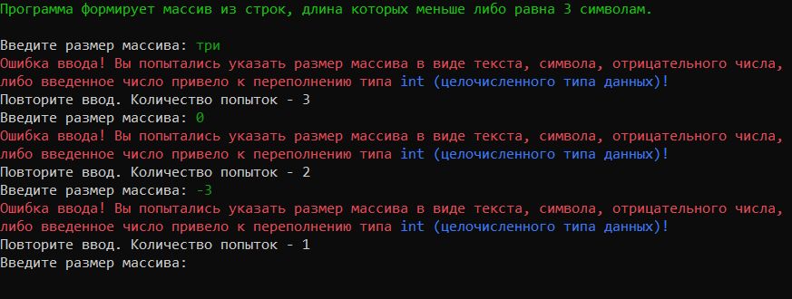
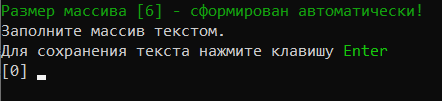
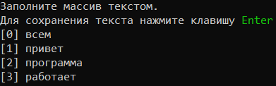
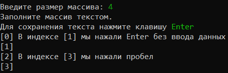
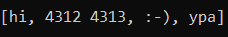
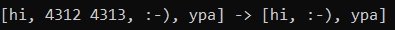

# Тестовое задание:
Данная работа необходима для проверки ваших знаний и навыков по итогу прохождения первого блока обучения на программе разработчик. Мы должны убедиться что базовое знакомство с it прошло успешно.

Задача алгоритмически не самая сложная, однако для полценного выполнения проверочной работы необходимо:
1. Создать репозиторий на GitHub
2. Нарисовать блок-схему алгоритма (можно обойтись блок-схемой основной содержательной части, если вы выделяете ее в отдельный метод)
3. Снабдить репозиторий оформленным текстовым описанием решения (файл README.md)
4. Написать программу, решающую поставленную задачу
5. Использовать контроль версий в работе над этим небольшим проектом (не должно быть так что все залито одним коммитом, как минимум этапы 2, 3 и 4 должны быть расположены в разных коммитах)

**Задача**: Написать программу, которая из имеющегося массива строк формирует массив из строк, длина которых меньше либо равна 3 символа. Первоначальный массив можно ввести с клавиатуры, либо задать на старте выполнения алгоритма. При решении не рекомендуется пользоваться коллекциями, лучше обойтись исключительно массивами.

**Примеры**:

["hello", "2", "world", ":-)"] -> ["2", ":-)"]

["1234", "1567", "-2", "computer science"] -> ["-2"]

["Russia", "Denmark", "Kazan"] -> []

## Общие положения:

Решение тестового задания выполнено по средствам языка программирования **`C# в виде консольного приложения`**.

Программа позволяет пользователю определить размер массива, ввести любые текстовые данные в консоли. 
После чего, алгоритм находит текстовые данные, длина которых меньше, либо равна трем, формирует новые массив,
и выводит в консоль ответ.

Программа состоит из ***4 функций:***
- `getFromUserArraySize` - функция, позволяющая задать размер массива;
- `FillArray` - функция заполнения массива данными;
- `FindStringOfThreeSymbol` - функция поиска в массиве текстовой информации, длина которой меньше, либа равна трем.
- `Print` - функция вывода массива на экран.

## Функция `getFromUserArraySize`.
Данная функция позволяет определить размер массива.

Для определения размера массива используется целочисленный тип данных *`integer`* *(в языке C# обозначается как int)*.


Описываемая функция является ***`рекурсивной`***, и имеет дополнительный параметр `count = 3`, отвечающий за количество попыток, в случаях, когда пользователь вводит некорректные данные (текст; символы; отрицательные числа; 0; числа с плавающей запятой; число, приводящее к переполнению типа данных int, пустой строки.

В случае, когда пользователь ввел некорректные данные, в консоли отображается ошибка и функция запускается повторно, выводя на экран количество оставшихся попыток:


В случае, если все попытки исчерпаны, то функция определяет размер массива автоматически в пределах значений от 1 до 9.



Еще одной особенностью использования функции *`getFromUserArraySize`* является увеличение, либо уменьшение дополнительного параметра **count**.
```
int getFromUserArraySize(int count = 3)
{
    тело функции
}
```
Пример использоывания функции по умолчанию:
```
int arraySize = getFromUserArraySize();
```
Пример использования функции с увеличением дополнительного параметра:
```
int arraySize = getFromUserArraySize(10);
```
***В данном случае, количество попыток некорректного ввода увеличится до 10.***

>*Примечание: в качестве альтернативы использования универсального способа работы с данными, возможно использовать конструкцию ***`try catch`*** - обработчик исключений:*
```
try
{
    корректное выполнение программы
}
catch возникновение исключения
{
    
    вывод ошибок либо работа с ошибками
}
```
Однако, мы использовали отдельную функцию с учетом возможных ошибок.

## Функция `FillArray`.
Данная функция предназначена для ручного ввода с консоли 
текстовых данных.
Для визуального оформления, при заполнении массива с консоли, отображается индекс массива:



>*Примечание: при вводе данных в виде пробела, функция будет считать его в качестве символа, что приведет к отображение результата в виде пустой строки.*



В результате ввода такого формата данных, ответ будет выглядеть следующим образом:
```
[массив с введенными данными] -> [,  ]
```

## Функция `FindStringOfThreeSymbol`
 Функция предназначения для поиска текстовых данных, имеющих длину от 1 до 3 символов, и внесение найденных значений в новый массив.
Данная функиця принимает массив, который был заполнен пользователем.
Далее определяется длина нового массива:
```
int count = 0;
for (int i = 0; i < array.Length; i++)
{
     temp = array[i];
    if (temp.Length <= 3)
    {
        count++;
    }
}
```
Таким образом, определили длину нового массива:

**`string[] resultArray = new string[count];`**

Далее заполняем новый массив данным в соответствии с условиями задачи:
```
string temp = string.Empty;
int  j = 0;
for (int i = 0; i < array.Length; i++)
{
     temp = array[i];
    if (temp.Length <= 3)
    {
        resultArray[j] = temp;
        j++;
    }
}
```
Таким образом, массив заполняется данными, длина которых **менее 4 символов**.
## Функция `Print`.
Данная функция предназначена для вывода данных, хранящихся в массиве.
Формат вывода массива представлен в следующем виде:


## Вывод конечного результата
Результатом выполнения программы является вывод исходного и результирующего массива в следующем виде:

